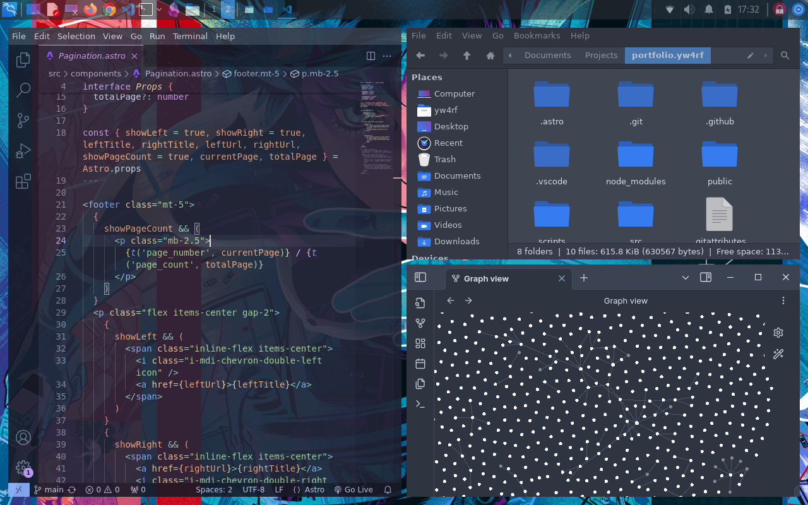
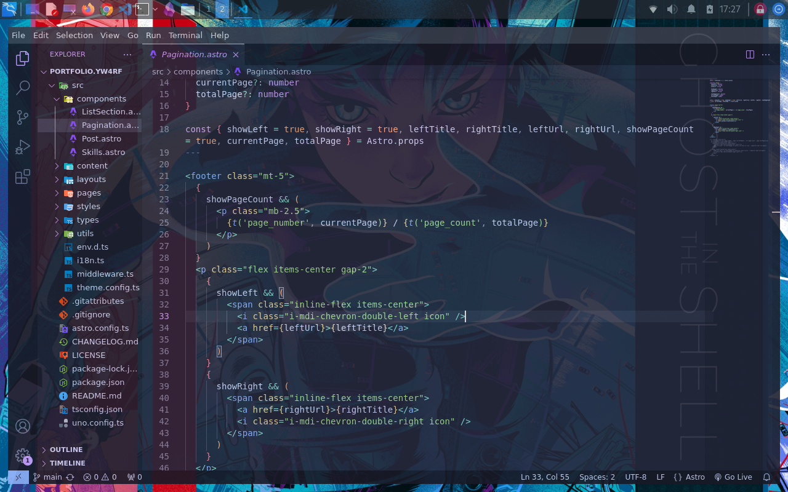
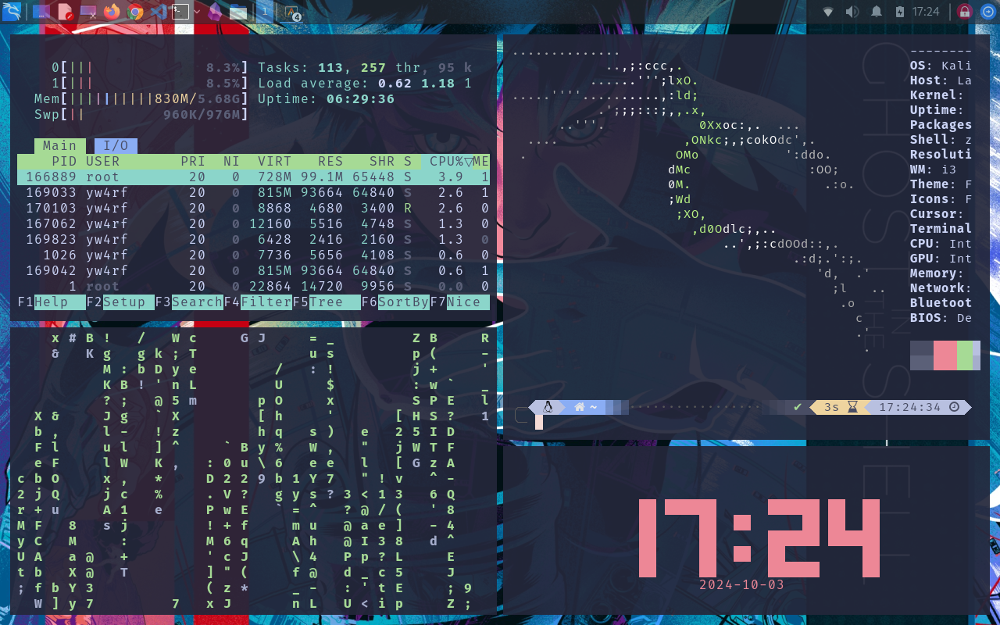

# Some personal files that I maybe will use in the future for my Linux desktop

Need to install:
- [Oh my zsh](https://github.com/ohmyzsh/ohmyzsh)
- [Powerlevel10k](https://github.com/romkatv/powerlevel10k) (p10k configure wizard)
- [Alacritty theme](https://github.com/alacritty/alacritty-theme)
- [Polybar](https://github.com/polybar/polybar)
- [i3](https://i3wm.org/)
 
 

 

 

 
  
Don´t take this seriously
